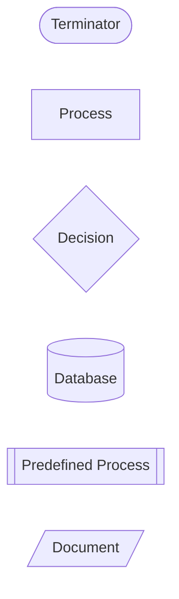
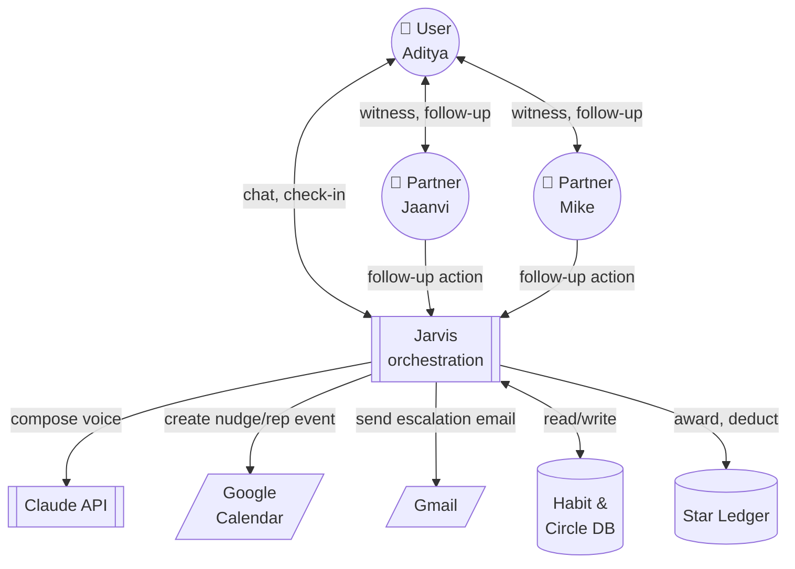
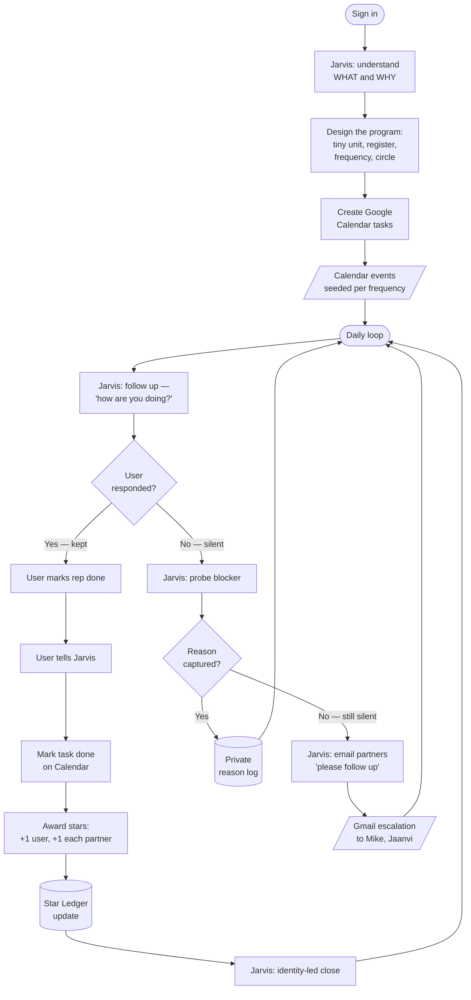
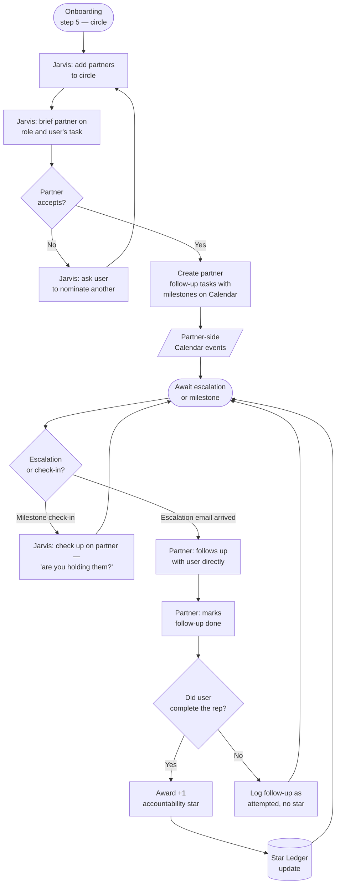

# HLD — System Overview

The whole product, at one altitude. Two humans, one AI coach, three interactions worth naming, and the star ledger that binds them.

## Purpose

Move a user (Aditya) from *"someone trying to build a habit"* to *"someone who has that habit,"* by combining a warm AI coach (Jarvis) with a small circle of accountability partners (Mike, Jaanvi). Jarvis orchestrates; the partners witness; the user performs the rep. Stars accumulate on both sides — the user's for keeping promises, the partners' for holding the user to them.

## Depends on

- [ADR-0001](../adr/0001-mobile-shell-pwa-vs-native.md) — mobile shell is a PWA
- [ADR-0002](../adr/0002-backend-shape-monolith-vs-services.md) — backend is a modular monolith with named seams
- [ADR-0003](../adr/0003-jarvis-llm-provider.md) — Jarvis's LLM provider (accepted as a deferral until real traffic)

## Actors and boundaries

| Actor | Role | Trust boundary |
|---|---|---|
| User (Aditya) | Signs up, sets a promise, keeps or misses it, closes the day | Authenticated session; owns their data |
| Jarvis | Composes voice, schedules nudges, orchestrates the loop, escalates on miss | In-process service (`jarvis-orchestration` module); calls Claude API outward |
| Accountability partners (Mike, Jaanvi) | Witness the promise, follow up on miss, mark follow-ups done, earn stars | Same auth model as user; belong to one circle at a time |
| Google Calendar | Nudge delivery channel and rep-completion marker | External; OAuth-scoped, per-user token |
| Gmail | Miss-follow-up delivery channel to partners | External; OAuth-scoped, per-user token |
| Claude API | LLM for Jarvis's voice | External; single API key at the service level |

## Legend for the flow diagrams

Following the shape convention you sent:

- **Terminator** — start/end of a flow
- **Process** — a step the system performs
- **Decision** — a branch based on state
- **Database** — persisted state (habits, streaks, star ledger)
- **Predefined Process** — a sub-flow defined elsewhere in this HLD
- **Document** — a delivery-channel artefact (Calendar event, Gmail message)

## 1 — System-context diagram

Who talks to whom, at the highest altitude. Not a call graph — a witness graph.

## 2 — Interaction: User ↔ Jarvis

The nine-step loop you named. Follows the demo's Golden Path in the middle; adds the escalation branch that runs when the user goes quiet.

## 3 — Interaction: Jarvis ↔ Accountability Partners

The parallel track: what Jarvis does with Mike and Jaanvi so that when the escalation fires they're briefed, willing, and rewarded for showing up.

## 4 — The star ledger

Two star types. Never conflated in the UI, never conflated in the ledger.

| Star | Awarded to | Trigger | Deducted? |
|---|---|---|---|
| `promise_kept` | User | User marks rep done on the same day as the promise | No — deducted stars would violate NFR1 (no shame) |
| `accountability_kept` | Partner | Partner followed up **and** user then completed the rep | No — same reason |

The ledger is append-only. A miss does not remove a star; it simply doesn't add one. History reads as "days on which stars were earned" — never as "days on which stars were lost."

## 5 — Data model (surface level)

Owned inside the `habit-loop` and `circle-witness` modules per ADR-0002. Not schema-level detail — the HLD names the entities and their owning module.

| Entity | Owner | Notes |
|---|---|---|
| `User` | `auth` | One row per human. |
| `Circle` | `circle-witness` | 1 user + 2–4 partners. |
| `Habit` | `habit-loop` | The commitment. FK to user. |
| `Promise` | `habit-loop` | One per active day the habit is scheduled. State: `pending` / `kept` / `missed`. |
| `MissReason` | `habit-loop` | Private. FK to promise. Never joined in any query the circle sees (NFR2). |
| `Partnership` | `circle-witness` | FK: user + partner. Role, accepted-at, brief-shown-at. |
| `FollowUpTask` | `circle-witness` | Scheduled partner-side check-in. Backed by a Calendar event. |
| `StarLedger` | `habit-loop` | Append-only. Type, awarded-to, awarded-because, timestamp. |

## 6 — Failure modes

The three we care about at this altitude:

- **Google Calendar / Gmail outage.** Jarvis's write to the Calendar or Gmail fails. The daily promise still exists in our DB — the user's in-app nudge still fires (via the PWA), and Jarvis logs a delivery failure. Escalation emails retry with exponential backoff, capped at three attempts. If Google is down for the whole nudge window, the check-in still works; the promise just wasn't seeded externally.
- **Claude API refusal or timeout.** Every Jarvis-composed line has a pre-written fallback (per FR6.3, extended across all surfaces). The UI never blocks on the LLM. A refusal is logged; a timeout is retried once, then falls back.
- **Partner ghosts.** A partner is never removed silently — the user is asked whether to keep them, replace them, or continue with a smaller circle. Ghost detection: no `FollowUpTask` marked in 14 days. Deliberate, not a hair-trigger.

## 7 — Open questions

Things that stay open until we have real traffic or Kanchuki's feedback reshapes them:

- **Escalation threshold** — how many silent days before Jarvis emails the partners? Current guess: two, tuned per register (Gentle: three; Neutral: two; Direct: one). Needs validation.
- **Partner follow-up format** — Gmail email is the default; do we also want an in-app inbox for partners, or is the email + Calendar event enough?
- **Star display** — kept off the current PRD to preserve simplicity. Do stars ever surface to the circle, or are they a private mechanic the user sees only? Leaning toward private for the same reason miss reasons are private.
- **Star currency** — do stars unlock anything, or are they purely symbolic? Deferring; if they unlock, we're building a game, not a habit companion.

## What this HLD does not cover

- Auth-service internals (session, refresh, revocation) — that's `Docs/hld/auth.md`, unwritten
- Delivery-service internals (queue, retry, backoff) — `Docs/hld/delivery.md`, unwritten
- Jarvis prompt engineering — lives in `Backend/prompts/` and the CLAUDE.md voice section
- The screen-side design — lives in the Frontend package and `Docs/design-agent-prompts.md`
