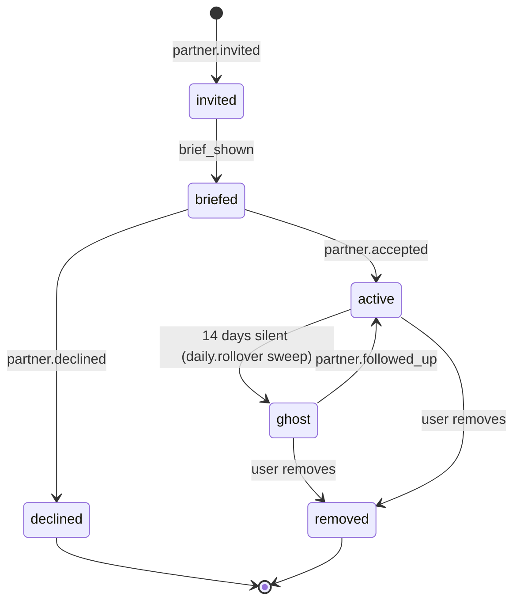

# LLD — Accountability Layer

The partner-side machinery. Partnership state, follow-up scheduling, escalation triggering, star awarding.

## Parent HLD / LLD

- [system-overview.md](../hld/system-overview.md) — see §3 (Jarvis ↔ Partners flow) and §4 (star ledger)
- [orchestration.md](orchestration.md) — the event bus this handler set registers against

## Scope

Owns the entire relationship between the user's promise and their circle. Concretely:

- Partnership lifecycle: invitation → briefing → acceptance → active → ghost → removed
- FollowUpTask creation and calendar-side scheduling
- Escalation threshold logic (silent-day count per register)
- Star ledger writes for both `promise_kept` and `accountability_kept` events
- Ghost detection (14-day rule)

Does NOT own:

- Voice composition for partner-facing messages (owned by `jarvis-orchestration.md`)
- Calendar / Gmail API calls (owned by Delivery, unwritten LLD)
- The star mechanic's UI expression (owned by the Frontend LLD)

## Interface

### Events consumed

| Event | Handler action |
|---|---|
| `partner.invited` | Create Partnership row (state: `invited`), enqueue briefing message via Jarvis Orchestration |
| `partner.accepted` | Advance Partnership to `active`, create initial FollowUpTasks on partner's calendar |
| `partner.followed_up` | Record follow-up, mark task-side timestamp, wait to see if user then completes |
| `user.checked_in` | If a partner follow-up preceded this in the same day, award `accountability_kept` star to each partner who followed up |
| `user.missed_day` | Increment silent-day counter; if threshold hit (per register), emit `escalation.triggered` |
| `daily.rollover` | Ghost sweep: any Partnership with no `partner.followed_up` in 14 days → mark ghost, notify user |

### Events emitted

| Event | Payload |
|---|---|
| `escalation.triggered` | `{ userId, partnerIds, missedDays, register, correlationId }` |
| `stars.awarded` | `{ recipientId, type, sourcePromiseId, timestamp }` |
| `partner.ghost_detected` | `{ userId, partnerId, silentSince, correlationId }` |

## Internals

### 1. Partnership state machine



Transitions are enforced in code — no direct writes to `partnership.state`. Every transition emits a `partnership.state_changed` internal event for the audit log.

### 2. FollowUpTask scheduling

When a partnership becomes `active`, seed a set of FollowUpTasks:

| Milestone | Cadence | Purpose |
|---|---|---|
| Day 1 | +24h from acceptance | Nudge partner that the user's habit started |
| Weekly | Every Sunday, 6pm partner-local | "How is the user doing?" check-in |
| On-demand | Fired by escalation, not scheduled | Emergency follow-up when user has gone silent |

Each FollowUpTask is:

- Persisted in `follow_up_task` table with FKs to Partnership and (nullable) Promise
- Materialised as a Google Calendar event on the partner's calendar (owned by Delivery)
- Marked `completed` when the partner acts (via HTTP `POST /partners/:id/follow-ups/:taskId/complete`)

### 3. Escalation threshold logic

Register-driven, defaults:

| Register | Silent-day threshold before escalation |
|---|---|
| Gentle | 3 |
| Neutral | 2 |
| Direct | 1 |

Silent day = a scheduled promise day where the user neither checked in nor probed the miss. A miss with a reason logged does not count as silent — the user is engaged, just off.

Threshold check runs on `user.missed_day`:

```ts
async function onMissedDay(evt: UserMissedDay, ctx: Context) {
  const user = await getUser(evt.userId);
  const threshold = ESCALATION_THRESHOLD[user.register];
  const silentDays = await countRecentSilentDays(user.id, threshold + 1);

  if (silentDays >= threshold) {
    const partners = await getActivePartners(user.id);
    await orchestrator.dispatch("escalation.triggered", {
      userId: user.id,
      partnerIds: partners.map(p => p.id),
      missedDays: silentDays,
      register: user.register,
      correlationId: ctx.correlationId,
    });
    await recordEscalation(user.id, silentDays);
  }
}
```

Escalation cooldown: once triggered, don't re-trigger for the same user until they've checked in at least once. Prevents daily escalation emails to partners during a rough stretch.

### 4. Star awarding

**`promise_kept`** — awarded on `user.checked_in` if the check-in is on a scheduled day and within the day's window. Written to `star_ledger` with `awardedBecause: "user_check_in"`.

**`accountability_kept`** — awarded when the following sequence completes in one day:

1. Partner emits `partner.followed_up` (an action on their side)
2. User then emits `user.checked_in` before the day's rollover

Handler logic:

```ts
async function onUserCheckedIn(evt: UserCheckedIn, ctx: Context) {
  await awardStar({ recipientId: evt.userId, type: "promise_kept", sourcePromiseId: evt.promiseId });

  const followUpsToday = await getFollowUpsForUserToday(evt.userId);
  for (const followUp of followUpsToday) {
    if (followUp.completedAt && followUp.completedAt < evt.checkedInAt) {
      await awardStar({
        recipientId: followUp.partnerId,
        type: "accountability_kept",
        sourcePromiseId: evt.promiseId,
      });
    }
  }
}
```

Stars are never deducted. Ledger is append-only. Query surfaces (e.g., partner's total accountability stars) are computed from the ledger — never denormalised into a mutable counter.

**Star visibility rule (hard):** each recipient sees only their own stars. A user sees their `promise_kept` stars only. A partner sees their `accountability_kept` stars only in a private partner-side view — never surfaced to the user (would violate NFR4's no-comparison rule). Enforced at the API query layer, not the UI. A UI-only hide is fragile; the API filter is the authoritative gate.

### 5. Ghost detection

Task-based, not time-based. A partner ghosts when their **three most recent scheduled FollowUpTasks have lapsed without completion.** Cadence-invariant: three lapsed weekly tasks is three weeks; three lapsed monthly tasks is three months. Matches the intuition that "two missed Sundays" is one iteration short of a ghost, and the third tips it.

Runs on every `daily.rollover`:

```sql
WITH recent_tasks AS (
  SELECT
    follow_up_task.partnership_id,
    follow_up_task.scheduled_for,
    follow_up_task.completed_at,
    ROW_NUMBER() OVER (
      PARTITION BY follow_up_task.partnership_id
      ORDER BY follow_up_task.scheduled_for DESC
    ) AS rn
  FROM follow_up_task
  WHERE follow_up_task.scheduled_for <= NOW()
)
SELECT partnership.id, partnership.partner_id
FROM partnership
JOIN recent_tasks ON recent_tasks.partnership_id = partnership.id
WHERE partnership.state = 'active'
  AND recent_tasks.rn <= 3
GROUP BY partnership.id, partnership.partner_id
HAVING BOOL_AND(recent_tasks.completed_at IS NULL);
```

Each row → emit `partner.ghost_detected`. The Jarvis Orchestration layer picks this up and gently asks the user whether to keep, replace, or continue smaller. **No silent removal, ever** — the circle change is always the user's choice (see HLD §6 failure modes).

Edge case: a brand-new partnership with fewer than three scheduled FollowUpTasks cannot ghost yet — the query naturally handles this (fewer than three rows → the `HAVING` clause fires only when all extant tasks are uncompleted). We accept a slightly longer lead time before a new partner can be flagged; better than a false positive.

## Tests

- Partnership state machine: all valid transitions, all forbidden transitions rejected
- FollowUpTask seeding on acceptance: exactly the milestones defined above, with correct times in partner's timezone
- Escalation threshold: for each register, `threshold - 1` silent days does not trigger; `threshold` triggers exactly once
- Escalation cooldown: second `user.missed_day` after escalation but before a check-in does not re-trigger
- Star awarding — both types, and the sequence dependency for `accountability_kept` (follow-up must precede check-in)
- Ghost detection: a partner with a followed-up task 13 days ago is not a ghost; 15 days ago is
- Append-only ledger: no update or delete operations allowed on `star_ledger` (enforced by DB constraint, not just app code)

## Operational notes

Metrics:

- `escalations_triggered_total{register}` — is the threshold well-calibrated?
- `partners_ghosted_total` — is the 14-day rule too aggressive?
- `stars_awarded_total{type}` — engagement signal
- `follow_ups_completed_total` — partner activity

Alerts:

- Ghost rate > 30% of active partnerships over 30 days → warn (something is off with partner onboarding)
- Escalation rate > 20% of active users per day → warn (voice is being too aggressive OR user cohort is disengaged)
- Any writes to `star_ledger` with `type` outside the enum → page (schema violation, someone's routed around the enum)

## Resolved

- **Partner-visible stars — private partner-side view.** Partners see their own `accountability_kept` stars; users never see them (would violate NFR4). Enforced at the API query layer, not the UI. Codified in §4.
- **Ghost window switched from time-based to task-based.** "Three consecutive lapsed FollowUpTasks" replaces the 14-day fixed window. Cadence-invariant. Codified in §5.
- **Email deliverability handed to Delivery LLD.** SPF/DKIM/DMARC setup is a delivery concern; the accountability layer emits the escalation event and lets Delivery own the send. See [delivery.md](delivery.md).

## Open questions

- Escalation cooldown — currently "hold until next user check-in." Should there be a maximum cooldown (e.g., 7 days without a check-in re-fires the escalation)? Currently a fully disengaged user would just stop getting partner-side emails, which may in fact be the right outcome.
